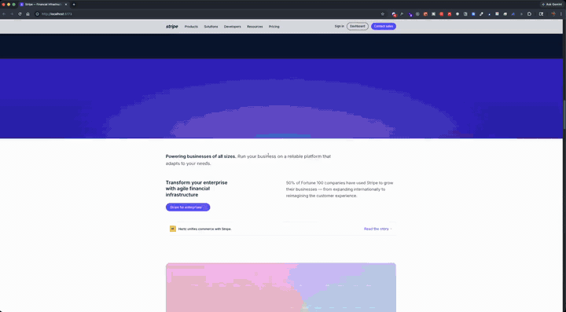
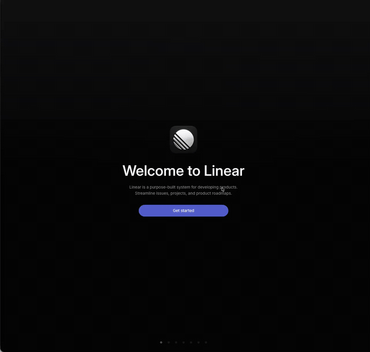
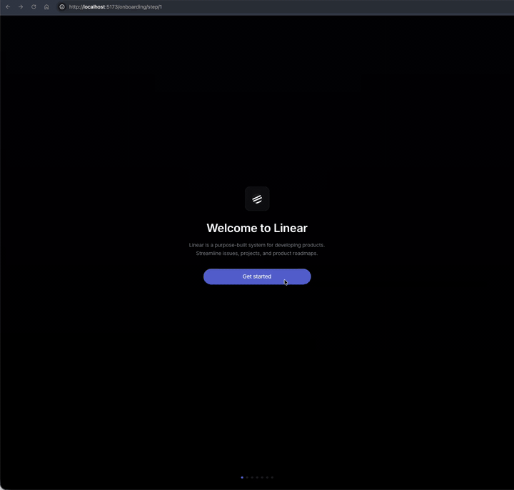
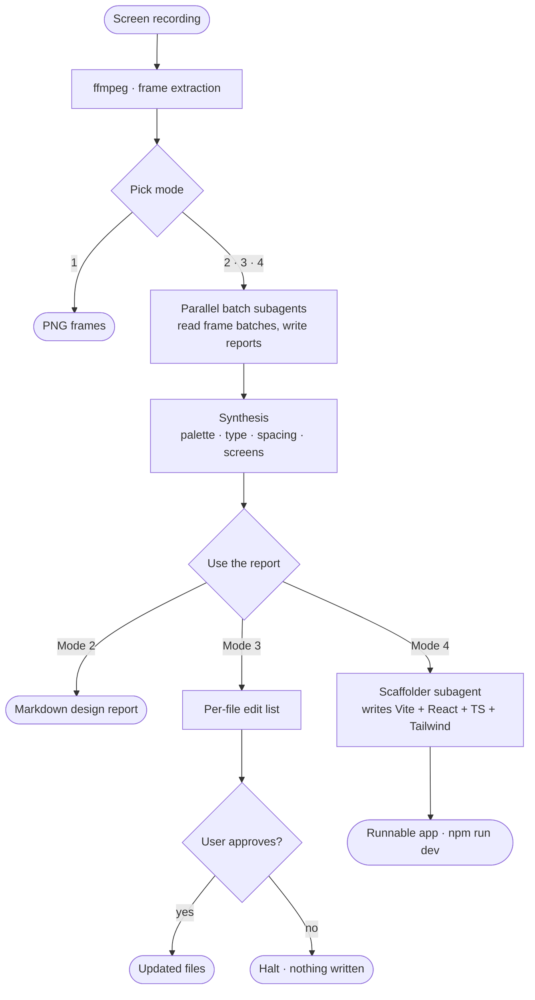

<div align="center">

<h1>video-to-ui</h1>

<p><b>🎬 Turn a UI screen recording into design data, code edits, or a runnable React scaffold.</b></p>

<p>
  <a href="https://opensource.org/licenses/MIT"></a>
  <a href="https://docs.claude.com/en/docs/claude-code/skills"></a>
  <a href="https://ffmpeg.org/"></a>
  <a href="https://github.com/mmohajer9/video-to-ui/stargazers"></a>
</p>

<video src="https://github.com/user-attachments/assets/f273e2fa-9fe6-4866-97bd-bfaa488e11e4" autoplay loop muted playsinline width="900"></video>

<sub><a href="#demos">See three before/after demos →</a> &nbsp;·&nbsp; <a href="#full-walkthrough">Watch the full 5-min walkthrough →</a></sub>

<p>
  <a href="#quick-start">Quick start</a>
  &nbsp;·&nbsp;
  <a href="#what-you-get">What you get</a>
  &nbsp;·&nbsp;
  <a href="#demos">Demos</a>
  &nbsp;·&nbsp;
  <a href="#demos-mp4">MP4 demos</a>
  &nbsp;·&nbsp;
  <a href="#full-walkthrough">Full walkthrough</a>
  &nbsp;·&nbsp;
  <a href="#how-it-works">How it works</a>
  &nbsp;·&nbsp;
  <a href="#install">Install</a>
</p>

</div>

---

<a id="quick-start"></a>

## ⚡ Quick start

Install the skill (one command, via the [skills.sh](https://skills.sh) CLI):

```bash
npx skills add mmohajer9/video-to-ui --skill video-to-ui --global
```

Restart Claude Code, then point the skill at a recording:

```text
/video-to-ui ~/Downloads/your-recording.mp4
```

The skill asks which mode to run and where to put the output, then gets to work. [Other install methods →](#install)

---

<a id="what-you-get"></a>

## ✨ What you get

Point it at a screen recording — a Figma prototype walkthrough, a mobile-app demo, a marketing clip, an internal Loom — and pick one of four deliverables when the skill runs.

| #   | Mode                       | What you get                                                                                                                                                                                                                                                 |
| --- | -------------------------- | ------------------------------------------------------------------------------------------------------------------------------------------------------------------------------------------------------------------------------------------------------------ |
| 1   | 🖼️ **Extract frames**       | A folder of PNGs from the video. No analysis, no synthesis. The fastest way to get the raw stills.                                                                                                                                                           |
| 2   | 🔍 **Analyze the design**   | A markdown report describing the design system on screen — palette in hex, type scale, spacing rhythm, button and card styles, iconography — plus a chronological inventory of the distinct screens. No code.                                                |
| 3   | 📝 **Compare against code** | Mode 2, plus a per-file list of concrete edits to bring named target files closer to the video (`replace --button-radius 4px → 8px in Button.tsx, frame 014`). Always shows the diff list first and waits for approval before editing.                       |
| 4   | ⚛️ **Scaffold a React app** | Mode 2, plus a runnable **Vite + React + TypeScript + Tailwind + Framer Motion** project at `app/`, with one component per screen, a mock API that mimics the video's timing, and Tailwind tokens populated from the analysis. `npm install && npm run dev`. |

Modes 3 and 4 build on mode 2 — both run the same analysis under the hood, then act on it differently. Pick mode 3 if you have a codebase you want to bring closer to the design in the video; pick mode 4 if you want a runnable starting point.

---

<a id="demos"></a>

## 🎥 Demos

Three before/after pairs. The recording on the left is the input; the artifact on the right is what mode 4 produced. Quick-loading GIF previews below — full-quality MP4 versions follow in the [next section](#demos-mp4).

### Stripe — Financial infrastructure landing

<div align="center">

<table>
<tr>
<th width="50%">Input recording</th>
<th width="50%">Output — runnable React scaffold</th>
</tr>
<tr>
<td>
  
</td>
<td>
  
</td>
</tr>
</table>

</div>

### Linear — Dashboard

<div align="center">

<table>
<tr>
<th width="50%">Input recording</th>
<th width="50%">Output — runnable React scaffold</th>
</tr>
<tr>
<td>
  
</td>
<td>
  
</td>
</tr>
</table>

</div>

### Linear — Mobile landing

<div align="center">

<table>
<tr>
<th width="50%">Input recording</th>
<th width="50%">Output — runnable React scaffold</th>
</tr>
<tr>
<td align="center">
  
</td>
<td align="center">
  
</td>
</tr>
</table>

</div>

---

<a id="demos-mp4"></a>

## 🎞️ Same demos in MP4

The same three before/after pairs above, served as native MP4 — sharper, with hover-controls. Click anywhere on a clip to play.

### Stripe (MP4)

<div align="center">

<table>
<tr>
<th width="50%">Input recording</th>
<th width="50%">Output — runnable React scaffold</th>
</tr>
<tr>
<td>
  <video src="https://github.com/user-attachments/assets/7068802d-bfff-4ff4-ac74-8224d62a754c" autoplay loop muted playsinline width="100%"></video>
</td>
<td>
  <video src="https://github.com/user-attachments/assets/dc917af4-9790-4a0d-a735-25f6307db4a7" autoplay loop muted playsinline width="100%"></video>
</td>
</tr>
</table>

</div>

### Linear Dashboard (MP4)

<div align="center">

<table>
<tr>
<th width="50%">Input recording</th>
<th width="50%">Output — runnable React scaffold</th>
</tr>
<tr>
<td>
  <video src="https://github.com/user-attachments/assets/fd918cc3-6bf7-4b57-a2a4-5e1ff7922cab" autoplay loop muted playsinline width="100%"></video>
</td>
<td>
  <video src="https://github.com/user-attachments/assets/aa7d0cff-c4db-4175-b50d-5927118764ce" autoplay loop muted playsinline width="100%"></video>
</td>
</tr>
</table>

</div>

### Linear Mobile (MP4)

<div align="center">

<table>
<tr>
<th width="50%">Input recording</th>
<th width="50%">Output — runnable React scaffold</th>
</tr>
<tr>
<td align="center">
  <video src="https://github.com/user-attachments/assets/c936e1f2-e460-4a91-a948-d0897f324f46" autoplay loop muted playsinline width="55%"></video>
</td>
<td align="center">
  <video src="https://github.com/user-attachments/assets/47365334-867b-45d7-acbc-c9ee4ee3939f" autoplay loop muted playsinline width="55%"></video>
</td>
</tr>
</table>

</div>

---

<a id="full-walkthrough"></a>

## ▶️ Full walkthrough

A soup-to-nuts run on the Stripe recording — drop in the video, pick mode 4, end up with a runnable React app. ~22 minutes of real work, compressed 4× to roughly 5 minutes. No audio.

<div align="center">

<video src="https://github.com/user-attachments/assets/51eadd64-0364-4804-b443-c68bafbed631" controls width="100%"></video>

</div>

---

<a id="how-it-works"></a>

## 🛠️ How it works

A video flows through one shared pipeline; the mode you pick determines where it exits.

<div align="center">



</div>

For modes 2–4, the skill walks the extracted frames in batches using a **2-tier subagent pattern**. Disposable subagents read frame batches in parallel and write compact markdown reports to disk. The main agent reads only those reports — never the raw frame images. This keeps the main context small even on long recordings, and makes the cost roughly linear in the number of distinct screens rather than the total frame count.

In mode 4, a separate dedicated subagent receives the design report and curated frame set and writes the entire React project in one pass, so the generated code stays out of the main agent's context too.

The 2-tier walk is adapted from [fabriqaai/ffmpeg-analyse-video-skill](https://github.com/fabriqaai/ffmpeg-analyse-video-skill).

---

## 💬 How to invoke

The minimum invocation is a path to a video. The skill asks which mode and where to put the output.

```text
/video-to-ui ~/Downloads/demo.mp4
```

It also auto-triggers on natural-language requests. Examples that route directly:

> *"What design system is this screen recording using? `~/demo.mp4`"* → **mode 2**
>
> *"Make the components in `src/components/` feel like this video: `demo.mp4`"* → **mode 3**
>
> *"Scaffold a working frontend app from this video"* → **mode 4**

A directory of pre-extracted frames works in place of a video, and skips the ffmpeg dependency:

```text
/video-to-ui /tmp/frames/
```

---

## 📁 Output directory

The skill creates one output directory per run, named after the video (or `video-to-ui-<timestamp>` if it can't infer a name). What lands in it depends on the mode:

```text
output/video-to-ui-<name>/
├── frames/
│   ├── frame_00001.png            # raw stills extracted by ffmpeg
│   ├── frame_00002.png
│   ├── ...
│   ├── batch_001.md               # per-batch reports written by subagents
│   ├── batch_002.md               # (mode 2-4 only)
│   └── ...
├── screens/                       # mode 2-4 only
│   ├── screen_01_hero.png         # curated key screens, named by content
│   ├── screen_02_pricing_grid.png
│   └── ...
├── design-analysis.md             # mode 2-4: palette, type, spacing,
│                                  # buttons, cards, screen inventory
└── app/                           # mode 4 only — runnable Vite project
    ├── package.json
    ├── tailwind.config.ts
    └── src/
        ├── components/            # shared atoms (Button, Card, Nav, ...)
        ├── sections/              # one component per distinct screen
        ├── pages/
        ├── lib/                   # mock API that mimics video timing
        └── ...
```

| Mode | Files produced                                                       |
| ---- | -------------------------------------------------------------------- |
| 1    | `frames/frame_*.png`                                                 |
| 2    | + `frames/batch_*.md`, `screens/`, `design-analysis.md`              |
| 3    | mode 2 outputs, plus the proposed edits applied to your target files |
| 4    | mode 2 outputs, plus `app/`                                          |

The `frames/batch_*.md` files are how disposable subagents pass their findings back without bloating the main agent's context. They're plain markdown — open one to see exactly what each subagent observed in its slice of the video.

---

<a id="install"></a>

## 📥 Install

The [Quick start](#quick-start) covers the npx path. Two more options:

<details>
<summary><b>Plugin marketplace (in-app)</b></summary>

&nbsp;

In Claude Code:

```text
/plugin marketplace add mmohajer9/video-to-ui
/plugin install video-to-ui@video-to-ui
```

</details>

<details>
<summary><b>Manual drop-in (no Node, no marketplace command)</b></summary>

&nbsp;

```bash
git clone https://github.com/mmohajer9/video-to-ui.git ~/src/video-to-ui
ln -s ~/src/video-to-ui/skills/video-to-ui ~/.claude/skills/video-to-ui
```

</details>

After any install method, restart Claude Code. The skill becomes available as `/video-to-ui` and auto-triggers on natural-language requests that match its description.

To uninstall (npx method): `npx skills rm video-to-ui`. The npx flow is powered by the open-source [`vercel-labs/skills`](https://github.com/vercel-labs/skills) CLI.

---

## 🧰 Requirements

- **[ffmpeg](https://ffmpeg.org/)** — required for frame extraction. Skip if you bring pre-extracted frames.
  - macOS: `brew install ffmpeg`
  - Debian/Ubuntu: `sudo apt install ffmpeg`
  - Windows: `winget install Gyan.FFmpeg`
- **[Node.js ≥ 18](https://nodejs.org/)** — required for mode 4 only, to run the generated app. The skill scaffolds the project but does not run `npm install` for you.

---

## 🤝 Pairs well with: `frontend-design`

In mode 4, if the [`frontend-design`](https://docs.claude.com/en/docs/claude-code/skills) skill is installed, the scaffolding subagent reads it before generating components and applies its layout, composition, and polish guidance on top of the video-derived design tokens. The video supplies the *signal* (palette, screen inventory, animation language); `frontend-design` supplies the *craftsmanship* (component composition, micro-interactions). The skill works without it — output is meaningfully richer with it.

---

<a id="other-agents"></a>

## 🔌 Using with other agents

This skill is **built and tested for Claude Code**. The pieces are split between agnostic and Claude Code-specific:

- **Mode 1 (frame extraction)** runs entirely through [`scripts/extract-frames.sh`](skills/video-to-ui/scripts/extract-frames.sh) — any agent that can execute bash will work.
- **Modes 2–4** depend on Claude Code's `Task` tool to dispatch *disposable* subagents that read frame batches in parallel and write compact reports back. That 2-tier walk is what keeps the main context tiny on long recordings. Agents with an equivalent subagent primitive are good fits; agents without one still produce the right output but burn the main context faster, which can hit limits on long videos.

| Agent                              | Compatibility                                   |
| ---------------------------------- | ----------------------------------------------- |
| Claude Code                        | ✅ Tested · primary target                      |
| Claude Agent SDK                   | ✅ Same skill format and subagent primitive     |
| Copilot CLI                        | ⚠️ Loads via the `skill` tool; subagent semantics differ |
| Cursor · Continue · Aider          | ⚠️ Use [`SKILL.md`](skills/video-to-ui/SKILL.md) as a long prompt; no batched parallelism |
| Generic LLM with file + bash       | ⚠️ Workable with manual orchestration            |

If you adapt this for another agent, please open a PR or post in [Discussions](https://github.com/mmohajer9/video-to-ui/discussions) — happy to ship vetted variants under an `agents/` folder.

---

## 📊 Frame budget

Default extraction rate scales with video length:

| Length   | Default fps |
| -------- | ----------- |
| ≤ 2 min  | 1 fps       |
| 2–10 min | 0.5 fps     |
| > 10 min | 0.25 fps    |

The skill caps the resulting frame count: ≤ 120 proceed silently, 121–300 print a warning before continuing, > 300 require an explicit override. For long videos, pre-extract just the segments that matter and pass the frames folder.

---

## 🚧 Scope and limitations

Things this skill is deliberately not:

- **Not an audio transcriber.** v1 has no Whisper / Gemini / OpenAI integration. If voiceover carries design intent ("make this calmer than the current page"), pass a notes file as the third argument or paste the relevant text into the conversation.
- **Not autonomous.** Mode 3 always shows the proposed edits first and waits for explicit approval. The approval gate is intentional — design judgments benefit from a human in the loop, and a wrong autopatch is harder to undo than a wrong recommendation.
- **Not a token-system fabricator.** If your target files have no design tokens or theme object, the skill flags that as a prerequisite step and stops short of inventing parallel tokens.
- **Mode 4 produces a scaffold, not a finished product.** The generated app is runnable and opinionated, with real components, real state, and a mock API that approximates the video's timing. It is a strong starting point, not a deliverable. Inferences about behaviors that weren't fully visible in the video are commented inline so you can replace them with real logic.

---

## 🗺️ Roadmap

Open to PRs on any of the following:

- Audio transcription pass (Whisper / Gemini / OpenAI) so voiceover-only design intent gets captured
- Mode 4 framework targets beyond Vite + React (Next.js, SvelteKit, SwiftUI scaffolds)
- Test fixtures: a small library of input videos with expected design-analysis snapshots
- Browser-extension recorder that emits clean frames directly, skipping ffmpeg

See [CONTRIBUTING.md](CONTRIBUTING.md) for what's wanted and what's off-limits.

---

## 🗂️ Repo layout

<details>
<summary>Click to expand</summary>

&nbsp;

```text
video-to-ui/
├── .claude-plugin/
│   └── marketplace.json        # registers the plugin so /plugin marketplace add works
├── skills/
│   └── video-to-ui/            # the skill itself
│       ├── .claude-plugin/
│       │   └── plugin.json
│       ├── SKILL.md            # main skill instructions
│       ├── references/
│       │   ├── batch-analyzer.md      # disposable-subagent prompt template
│       │   └── synthesis-checklist.md # rules for the synthesis phase
│       └── scripts/
│           ├── extract-frames.sh      # ffmpeg wrapper with --help, validation, --scene mode
│           └── check-deps.sh          # ffmpeg/ffprobe presence check with install hints
├── assets/                     # demo media shown in this README
│   ├── demo-hero.gif           # top-of-README pipeline overview
│   ├── demo-short.mp4          # same overview as MP4
│   ├── demo-full-4x.mp4        # full walkthrough at 4x speed
│   └── demos/
│       ├── stripe/             # input.gif, input.mp4, output.gif, output.mp4
│       ├── linear-dashboard/   # input.gif, input.mp4, output.png (placeholder)
│       └── linear-mobile/      # input.gif, input.mp4, output.png (placeholder)
├── README.md
├── LICENSE
├── CHANGELOG.md
└── CONTRIBUTING.md
```

</details>

---

## 🔗 Related work

- **[fabriqaai/ffmpeg-analyse-video-skill](https://github.com/fabriqaai/ffmpeg-analyse-video-skill)** — origin of the 2-tier subagent pattern this skill borrows. Use it for general video summarization rather than UI-specific analysis.
- **[jordanrendric/claude-video-vision](https://github.com/jordanrendric/claude-video-vision)** — adds Whisper / Gemini / OpenAI audio transcription on top of frame analysis. Use it when voiceover content matters.
- **[JosiahSiegel/claude-plugin-marketplace](https://github.com/JosiahSiegel/claude-plugin-marketplace)** — community marketplace including a general-purpose `ffmpeg-master` plugin.

---

## 📄 License

MIT — see [LICENSE](LICENSE). Issues and PRs welcome via [CONTRIBUTING.md](CONTRIBUTING.md).

<div align="center">

<sub>⭐ If this saved you an afternoon, a star helps others find it.</sub>

</div>
